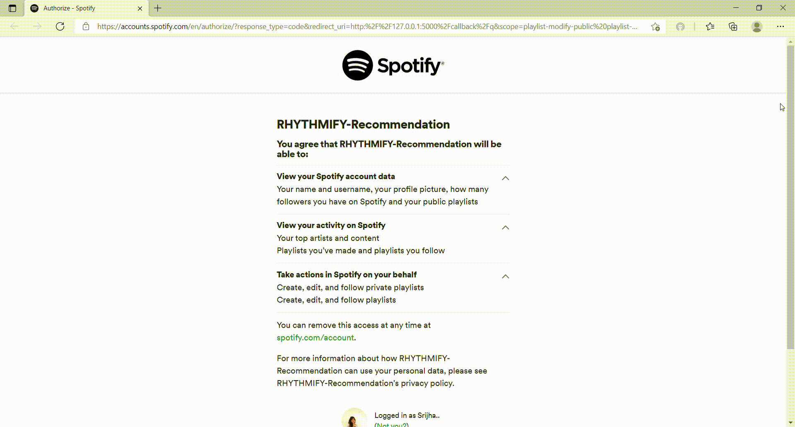
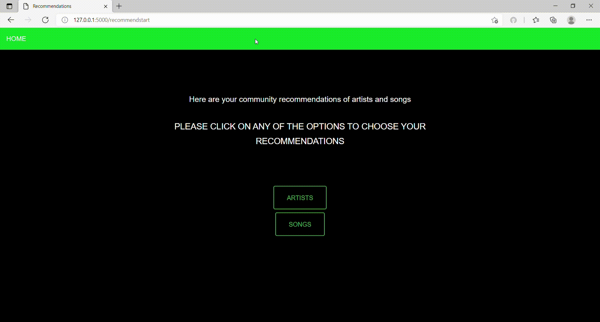
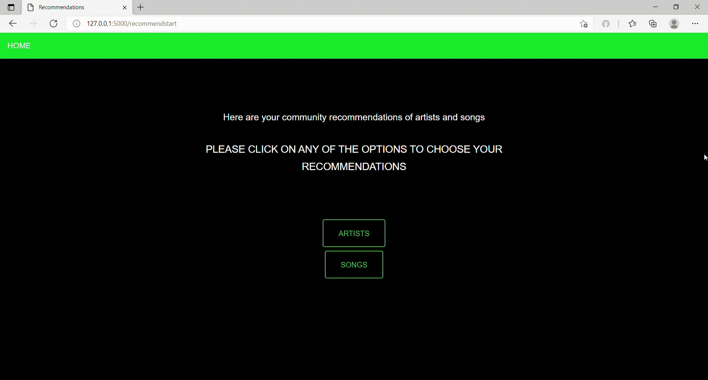

# Rhythmify - Spotify Music Analytics 
Rhythmify is a music analytics Flask web application that leverages the Spotify API for generating playlists based on recommendations and helps us in creating a user analysis of their music tastes. This web application is deployed on Heroku and conatinerized using Docker. 

### Features of the application
- Content Based Recommendation system using Tfidf Vectorizer and cosine similarity
- User Dashboard using Plotly
- Playlist Generator using Spotify API

### Demo of the application

1. Authorization into Spotify Account:
For this, it is required to create an account in Spotify Web API and get a Client_ID and Client_Secret_Key, additionally update the redirect URI including the port in the Spotify API user dashboard. For more details on the authorization procedure, please have a look at : https://developer.spotify.com/documentation/web-api/quick-start/
For more details on the API reference end-points please have a look at: https://developer.spotify.com/documentation/web-api/reference/



2. Playlist Generator:
I had incorporated Spotify-API and used the playlist API endpoints to extract my playlist data. Once the playlist is displayed, a new playlist can be generated based on the few tracks selected from the previously saved playlists. I had used the recommendation function provided by the Spotify API to generate the new playlist.


3. User Dashboard.
This is a music analytics dashboard created using Plotly. I have analyzed my top tracks and artists and created various visualzations. 


4. Recommendation System.
A content-based recommendation system was created to recommend similar artists and songs. 
For recommending artists, I had leveraged cosine similarity based on genre and tracks and Tf-idf vectorizer to predict the artists based on similarity scores. I had used the   [Spotify Kaggle dataset](https://www.kaggle.com/yamaerenay/spotify-dataset-19212020-160k-tracks)
Similarily, for songs I had used the same technique, but this time I created a tfidf matrix based on the artists. 



5. Application Stack

- Backend: Flask
- API used: Spotify-API
- Frontend: HTML, CSS
- Visualization: Plotly
- Deployment: Heroku\

## How to run the application?
- Clone the repo into your local machine
```
git clone https://github.com/Srijha09/Rhythmify.git
```

- Create a Developers account and set up a new project in Spotify API Dashboard https://developer.spotify.com/dashboard/login
- Once the application is cloned and the account is setup, run the flask app
```
$ export FLASK_APP="app_name"
$ export FLASK_ENV=development
$ flask run
```


### Code Improvements (In progress)
- Create Flask Blueprints 
- Lyric2Vec and Audio Modelling Recommendation system
- Mood Based Song Prediction


### References:
1. https://github.com/AcrobaticPanicc/Spotify-Playlist-Generator1/tree/master/app
2. https://github.com/Deffro/statify

